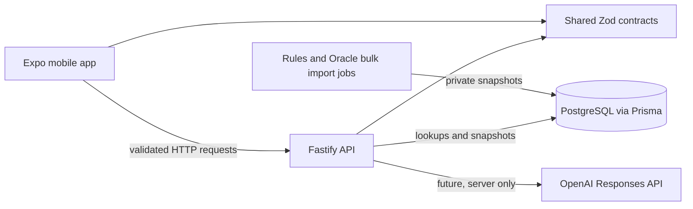

# Architecture map

## Current workspace

```text
apps/mobile/        Expo Router and React Native screens
apps/api/           Fastify HTTP application and server entry point
packages/contracts/ Zod schemas shared at API and mobile boundaries
```

The mobile app calls the API and validates the response with shared contracts. The API owns server-side behavior and is the only boundary for database and model access. It currently implements `GET /health` and `GET /api/cards/lookup?name=...`; its bounded evidence assembly service uses local PostgreSQL card and rule snapshots. Rules and Oracle imports create versioned snapshots, while question interpretation and authentication remain in development.

## Planned data flow



The contract package defines external request and response shapes. API routes should validate input before calling domain services. Domain services should accept ordinary typed values rather than Fastify or React Native objects. Database queries, source imports, retrieval, model calls, and authorization decisions belong on the server.

`apps/api/src/search/retrieval.ts` performs case-insensitive exact face matching against an indexed name, full-text rule matching through PostgreSQL, and bounded expansion of matched rules' parents and outbound references. The evidence packet identifies its immutable snapshot and source metadata so later ruling operations can persist citations to the exact imported records.

## Repository locations

- `apps/mobile/app`: Expo Router screens.
- `apps/mobile/src`: mobile features and API client as they are added.
- `apps/api/src`: Fastify setup and HTTP routes.
- `packages/contracts/src`: schemas and shared types.
- `prisma`: database schema and migrations, introduced by F05.
- `scripts`: local maintenance and validation commands.
- `docs`: architecture and source decision records.

Keep secrets in server-side environment configuration. Never put an OpenAI key or OAuth client secret in an `EXPO_PUBLIC_*` variable; Expo embeds those public variables in the client bundle.
